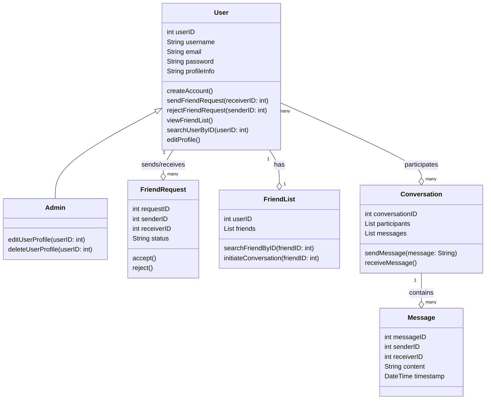

# chat-app

USER STORY

* As an user, I want to be able to create a conversation with another user  
* As an user, I want to be able to see all my friend in the friends list
* As a user I want to be able to register/login on the app
* As a registered user I want to send messages to other users
* As an user I want to be able to search other users on the app
* As an user, I want to be able to accept or decline a received invitation
* As an admin, I want to be able to edit the profile of other users  
* As an user, I want the message to be marked as seen when I open it
* As an user I want to be able to search my friends in my friends list
* As an admin, I want to be able to remove users from the app

    

CLASS DIAGRAM

Source control cu git: avem 11 branches si 26 commits  
Raportare bug si rezolvare cu pull request: https://stefanpoleac.atlassian.net/browse/TASK-27  |     Pull request: https://github.com/PoleacLiviuStefan/chat-app/pull/11  
Comentarii cod: comentariile se afla in fisierele cu codul  
Folosirea unui tool de AI: am folosit ChatGPT pe tot parcursul dezvoltarii proiectului. Un moment sugestiv ar fi urmatorul https://chatgpt.com/share/7bec9f94-5dd6-47f3-9f8b-80e480efecdf  

DEMO:
https://www.youtube.com/watch?v=m-ie-RJW5Jk&feature=youtu.be

  

  
  
JIRA - https://stefanpoleac.atlassian.net/jira/software/c/projects/TASK/list  

Am trecut in jira taskuri, pe care le-am grupat in 3 sprinturi.

