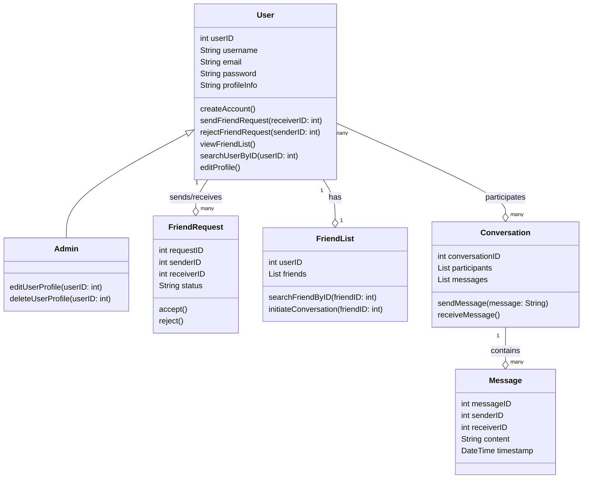

# chat-app

CLASS DIAGRAM

  
  
USER STORY

* As an user, I want to be able to create a conversation with another user  
* As an user, I want to be able to see all my friend in the friends list
* As a user I want to be able to register/login on the app
* As a registered user I want to send messages to other users
* As an user I want to be able to search other users on the app
* As an user, I want to be able to accept or decline a received invitation
* As an admin, I want to be able to edit the profile of other users  
* As an user, I want the message to be marked as seen when I open it
* As an user I want to be able to search my friends in my friends list
* As an admin, I want to be able to remove users from the app  

JIRA - 

Raportare bug: https://stefanpoleac.atlassian.net/browse/TASK-24  
